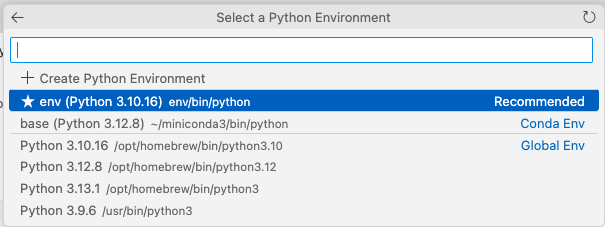

# Local Installation

This installation is tested for a Mac (M4 / Sequia) using VSCode. 
First you need to install mini-conda.

## Install mini-conda (if not already installed)
We choose the mini-conda version of anaconda, since it is much smaller and faster to install. See https://docs.anaconda.com/miniconda/install/#quick-command-line-install to install mini-conda (based on your operating system). 

### Activate conda

```bash
source ~/miniconda3/bin/activate
```

### Activate conda environment
Activate the conda enviroment in the project folder:
```bash
conda create --prefix ./env python=3.10
conda activate ./env
```

#### Install the required packages (in Conda)

```bash
conda install numpy pandas matplotlib seaborn scikit-learn jupyterlab
```

#### Install the required packages (in pip)

For pytorch see https://pytorch.org/get-started/locally/ 
```bash
pip install torch torchvision torchaudio keras
```

## Testing the installation
Open the [notebooks/00_test_local_installation.ipynb](notebooks/00_test_local_installation.ipynb) and run the cells. At the beging your are asked to choose a python enviroment. Please choose the conda enviromet like in the screenshot below.
It might happen that there is no environment to pick, then it could help to first install the suggested extensions of vsCode (jupyter notebook, python).





# 🚧 WORK IN PROGRESS 🚧 below that

## Installation on a Windows machine
Installation auf laptop mit Anaconda
Beate's laptop: rufe anaconda prompt auf, gehe in C:\Users\sick\Documents\GitHub\dlwbl_eth25> und dann Commands  
Ab "Activate conda environment" ausführen.


## Creating a yaml file for easy installation
#### Save the environment [Optional]

```bash
conda env export --no-builds > environment.yml
```
In the evirnoment.yml you need to change the name of the environment to 

#### Install the environment from the environment.yml file [Optional]
Instead of installing the packages one by one, you can also install the environment from the environment.yml file. 
```bash
conda env create -f environment.yml
```